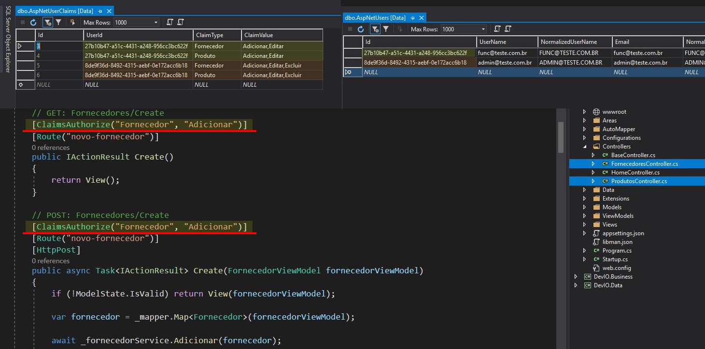

<h1 align="center">
  ||| &nbsp; Aplicação MVC Core &nbsp; |||
</h1>

<h3 align="center">
Resultado dos estudos relacionado ao curso "Dominando o ASP.NET MVC Core" do <a href="https://desenvolvedor.io/inicio">desenvolvedor.io</a>
</h3>

<h1>
  
</h1>

## Índice

- [Sobre](#-sobre)
- [Tecnologia utilizada](#-tecnologia-utilizada)
- [Objetivos](#-objetivos)
- [Para clonar o projeto](#-para-clonar-o-projeto)
- [Importante](#-importante)

---

## 🔖 Sobre

Esta é uma aplicação MVC onde é possível realizar cadastros de forcedores e seus respectivos produtos. O intuito do curso ministrado pelo Eduardo Pires (Microsoft Regional Director) foi ensinar todas as melhores práticas recomendadas pela Microsoft, passando pelas Controllers, Models, Views, Áreas, Injeções de Dependências, Entity Framework Core, Segurança com o ASPNET Identity, proteção de dados com User Secrets, Acesso ao banco de dados via Repositórios, Mapeamento de entidades em ViewModels com Automapper, Roteamento inteligente, Tratamento de erros etc.

---

## 🚀 Tecnologia utilizada

- [ASP.NET MVC Core](https://dotnet.microsoft.com/apps/aspnet)

---

## 🎯 Objetivos

Os objetivos desta aplicação é permitir:

- **Cadastro de Usuários:**
Além de cadastrá-los, podemos controlar o nível de permissão (através das claims) que o usuário pode ter dentro da aplicação

- **Visualizar, Cadastrar, Editar e Excluir Fornecedores:**
Tudo isso respeitando o nível de permissão do usuário

- **Vizualizar, Cadastrar, Editar e Excluir Produtos:**
Respeitando o nível de permissão do usuário

---

## ⚙ Para clonar o projeto

```bash
  # clonar o projeto
  $ git clone https://github.com/DigooDS/appMvc.git

  # acessar a pasta do projeto
  $ cd appMvc

  # para restaurar todas as dependências
  $ dotnet restore

```

---

## 📌 Importante

<p>
  
</p>

As permissões granulares (através das Claims) devem ser trabalhadas dentro o SQL Server local utilizando as IDs dos usuários cadastrados dentro da tabela "AspNetUserClaims" e configurando dentro das Controllers "FornecedoresController.cs" e "ProdutosController.cs".

---

<i>Desenvolvido por RodrigoDS</i> 🤓
